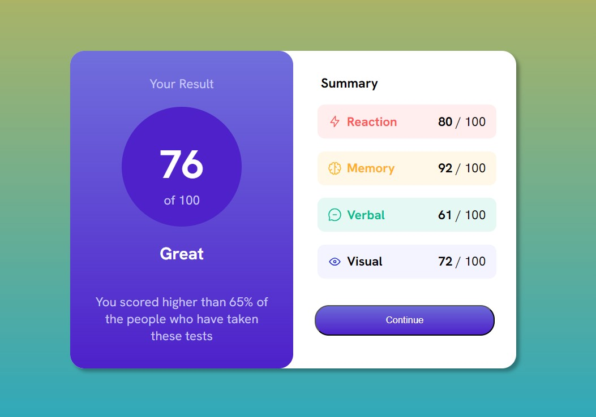

# Frontend Mentor - Results summary component solution

This is a solution to the [Results summary component challenge on Frontend Mentor](https://www.frontendmentor.io/challenges/results-summary-component-CE_K6s0maV). Frontend Mentor challenges help you improve your coding skills by building realistic projects. 

## Table of contents

- [Overview](#overview)
  - [The challenge](#the-challenge)
  - [Screenshot](#screenshot)
  - [Links](#links)
- [My process](#my-process)
  - [Built with](#built-with)
  - [What I learned](#what-i-learned)
  - [Continued development](#continued-development)
  - [Useful resources](#useful-resources)
- [Author](#author)
- [Acknowledgments](#acknowledgments)


## Overview

### The challenge

Users should be able to:

- View the optimal layout for the interface depending on their device's screen size
- See hover and focus states for all interactive elements on the page
- **Bonus**: Use the local JSON data to dynamically populate the content... DONE!

### Screenshot




### Links

- Solution URL:  [Github repository](https://github.com/memominguez/results-summary-component)
- Live Site URL:  [Github pages](https://memominguez.github.io/results-summary-component/)


## My process

### Built with

- HTML5 markup
- CSS custom properties
- Flexbox
- CSS Grid
- Vanilla Javascript


### What I learned

- Practiced the application of CSS pseudo-class :nth-child()
- Found out how to render list items dynamically, in vanilla Javascript
- Fetching data from a json file required an http local server, so instead of the json file, a data array was created and written at the beginning of the script.js, to be called directly.


Styling list items

```css
li:nth-child(1) {
  background: hsla(0, 100%, 67%, 0.1);
}

li:nth-child(1) .item-left p {
  color: var(--light-red);
  font-weight: 700;
}
```

Render list items dynamically, from a data file.
```js
const listEl = document.querySelector("ul");

data.forEach((item) => {
  listEl.insertAdjacentHTML(
    "beforeend",
    `
            <li>
            <div class="item-left">
              
              <p class="category-red">${item.category}</p>
            </div>
            <div class="item-right">
              <p><span class="score-span">${item.score} </span><span>/ 100</span></p>
            </div>
          </li>
            `
  );
});

```


### Continued development

Continue improving my coding skills by developing challenging applications, like this one.

### Useful resource (Video tutorial)

- [Read JSON File into HTML](https://www.youtube.com/watch?v=Oage6H4GX2o) - Adapted the Javascript snippet into this application.


## Author


- Website - [Guillermo Dominguez](https://gdominguez-portfolio.netlify.app)
- Frontend Mentor - [@memominguez](https://www.frontendmentor.io/profile/memominguez)


## Acknowledgments


Thanks to all those who share their knowledge, free of charge, through video tutorials in the youtube platform.
 
